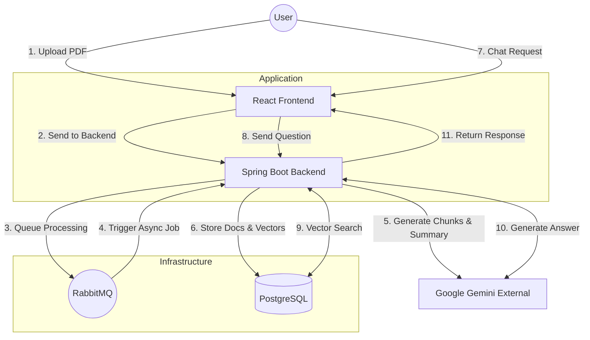

# Recall

A RAG-based document Q&A system that allows you to upload PDF documents, process them with AI, and ask questions to get intelligent answers based on the document content. If the document lacks context, or the answer can be supplemented by general knowledge, then the LLM will do so.

## Table of Contents

- [What is RAG?](#what-is-rag)
  - [How It Works](#how-it-works)
  - [Key Benefits](#key-benefits)
- [Tech Stack and Architecture](#tech-stack-and-architecture)
  - [Backend](#backend)
  - [Frontend](#frontend)
- [Prerequisites](#prerequisites)
- [Installation & Setup](#installation--setup)
  - [1. Clone the Repository](#1-clone-the-repository)
  - [2. Configure Environment Variables](#2-configure-environment-variables)
  - [3. Set Up Google Cloud Credentials](#3-set-up-google-cloud-credentials)
  - [4. Start Docker Services](#4-start-docker-services)
  - [5. Set Up Backend](#5-set-up-backend)
  - [6. Set Up Frontend](#6-set-up-frontend)
- [Running Locally](#running-locally)
  - [Option 1: Using the Start Script (Backend Only)](#option-1-using-the-start-script-backend-only)
  - [Option 2: Manual Start](#option-2-manual-start)
  - [Access the Application](#access-the-application)
- [Configuration](#configuration)
  - [File Size Limits](#file-size-limits)
  - [AI Models](#ai-models)
- [Usage](#usage)
  - [Uploading a Document](#uploading-a-document)
  - [Asking Questions](#asking-questions)
  - [Managing Documents](#managing-documents)
- [Project Structure](#project-structure)
- [API Endpoints](#api-endpoints)
- [Troubleshooting](#troubleshooting)
  - [Docker Services Not Starting](#docker-services-not-starting)
  - [Backend Connection Issues](#backend-connection-issues)
  - [Frontend Not Connecting to Backend](#frontend-not-connecting-to-backend)
- [License](#license)

## What is RAG?

**Retrieval-Augmented Generation (RAG)** is an AI framework that enhances Large Language Model (LLM) responses by combining them with external knowledge retrieval. Instead of relying solely on the model's training data, RAG grounds responses in your specific documents and data.

### How It Works

1. **Document Processing**: Documents are split into chunks, converted into vector embeddings (numerical representations), and stored in a vector database
2. **Retrieval**: When a user asks a question, it's converted to an embedding and used to search the vector database for semantically similar content
3. **Augmented Generation**: Retrieved chunks are injected into the LLM's context, allowing it to generate accurate, grounded responses based on your actual documents

### Key Benefits

- **Factual Accuracy**: Reduces hallucinations by grounding responses in source material
- **Up-to-date Information**: LLM isn't limited to training data cutoff dates
- **Domain Specificity**: Leverages your private/specialized knowledge base
- **Verifiable Sources**: Can cite which documents informed the response 

## Tech Stack and Architecture



### Backend
- **Spring Boot 4.0** with **Kotlin**
- **PostgreSQL** with **pgvector** extension for vector similarity search
- **RabbitMQ** for asynchronous document processing
- **Google Cloud Vertex AI**:
  - Gemini 2.5 Flash for text generation
  - text-embedding-005 for embeddings
- **Flyway** for database migrations
- **PDFBox** for PDF text extraction

### Frontend
- **React 19** with **TypeScript**
- **Vite** for build tooling
- **React Router DOM** for navigation
- **React Markdown** for rendering AI responses


## Prerequisites

- **Docker Desktop** (for PostgreSQL and RabbitMQ)
- **Java 21** (for Spring Boot backend)
- **Node.js** (includes npm) (for React frontend)
- **Google Cloud Account** with:
  - Vertex AI API enabled
  - Service account credentials with appropriate permissions
  - Project ID and location configured

## Installation & Setup

### 1. Clone the Repository

```bash
git clone https://github.com/ahmed-alzahrani/recall.git
cd recall
```

### 2. Configure Environment Variables

Create a `.env` file in the root directory with the following variables, as per `.env.example`

```bash
# Database Configuration
POSTGRES_USER=your_postgres_user
POSTGRES_PASSWORD=your_postgres_password
POSTGRES_DB=recall

# RabbitMQ Configuration
RABBITMQ_USER=your_rabbitmq_user
RABBITMQ_PASSWORD=your_rabbitmq_password

# Google Cloud Configuration
GOOGLE_CLOUD_PROJECT_ID=your_gcp_project_id
GOOGLE_CLOUD_LOCATION=us-central1
```

### 3. Set Up Google Cloud Credentials

1. Create a service account in your Google Cloud project
2. Grant it the necessary Vertex AI permissions
3. Download the service account JSON key file
4. Set the `GOOGLE_APPLICATION_CREDENTIALS` environment variable:

```bash
export GOOGLE_APPLICATION_CREDENTIALS="/path/to/your/service-account-key.json"
```

Or add it to your `.env` file (if your shell supports it) or system environment variables.

### 4. Start Docker Services

Start PostgreSQL and RabbitMQ using Docker Compose:

```bash
docker-compose up -d
```

This will start:
- PostgreSQL on port 5432 (with pgvector extension)
- RabbitMQ on ports 5672 (AMQP) and 15672 (Management UI)

You can verify the services are running:
```bash
docker-compose ps
```

### 5. Set Up Backend

The backend uses Gradle wrapper, so no additional installation is needed.

### 6. Set Up Frontend

Navigate to the frontend directory and install dependencies:

```bash
cd frontend
npm install
```

## Running Locally

### Option 1: Using the Start Script (Backend Only)

The `start.sh` script will start Docker services and run the backend:

```bash
./start.sh
```

Make sure your `.env` file is in the root directory and `GOOGLE_APPLICATION_CREDENTIALS` is set.

### Option 2: Manual Start

#### Start Docker Services

```bash
docker-compose up -d
```

#### Start Backend

```bash
cd backend
./gradlew bootRun
```

The backend will start on `http://localhost:8080`

#### Start Frontend

In a new terminal:

```bash
cd frontend
npm run dev
```

The frontend will start on `http://localhost:3000` (or another port if 3000 is occupied)

### Access the Application

- **Frontend**: http://localhost:3000
- **Backend API**: http://localhost:8080/api
- **RabbitMQ Management UI**: http://localhost:15672 (use your RABBITMQ_USER and RABBITMQ_PASSWORD)

## Configuration

### File Size Limits

- Maximum file size: 65MB (configurable in `backend/src/main/resources/application.properties`)

### AI Models

- **Embedding Model**: `text-embedding-005`
- **Text Generation Model**: `gemini-2.5-flash`
- **Embedding Dimension**: 768
- **Similar Chunks Retrieved**: 5 (for Q&A)

Configuration can be adjusted in `backend/src/main/resources/application.properties`.

## Usage

### Uploading a Document

1. Click "Upload" in the top navigation
2. Drag and drop a PDF file or click to select
3. Wait for the document to be processed (uploading → processing → completed)
4. You'll see a success message when processing is complete

### Asking Questions

1. Click "Documents" in the top navigation to open the sidebar
2. Click on a completed document
3. Type your question in the chat input
4. Press Enter or click the send button (↑)
5. The AI will answer based on the document content

### Managing Documents

- View all documents in the sidebar
- See document status (PENDING, PROCESSING, COMPLETED, FAILED)
- View document summaries
- Click on completed documents to start chatting

## Project Structure

```
recall/
├── backend/                 # Spring Boot backend
│   ├── src/main/kotlin/    # Kotlin source code
│   ├── src/main/resources/ # Configuration and migrations
│   └── build.gradle.kts    # Gradle build configuration
├── frontend/               # React frontend
│   ├── src/               # React source code
│   └── package.json       # npm dependencies
├── docker-compose.yml      # Docker services configuration
├── start.sh               # Convenience script to start services
└── README.md              # This file
```

## API Endpoints

- `POST /api/documents/upload` - Upload a PDF document
- `GET /api/documents` - List all documents
- `GET /api/documents/{documentId}` - Get document details
- `GET /api/documents/{documentId}/status` - Get document processing status
- `POST /api/documents/{documentId}/chat` - Ask a question about a document

## Troubleshooting

### Docker Services Not Starting

- Ensure Docker Desktop is running
- Check if ports 5432, 5672, or 15672 are already in use
- Verify your `.env` file has all required variables

### Backend Connection Issues

- Verify Docker services are running: `docker-compose ps`
- Check that environment variables are set correctly
- Ensure `GOOGLE_APPLICATION_CREDENTIALS` is set and points to a valid service account key

### Frontend Not Connecting to Backend

- Verify the backend is running on port 8080
- Check the API base URL in `frontend/src/services/api.ts`
- Ensure CORS is properly configured (default allows `http://localhost:3000`)

## License

[Add your license here]
